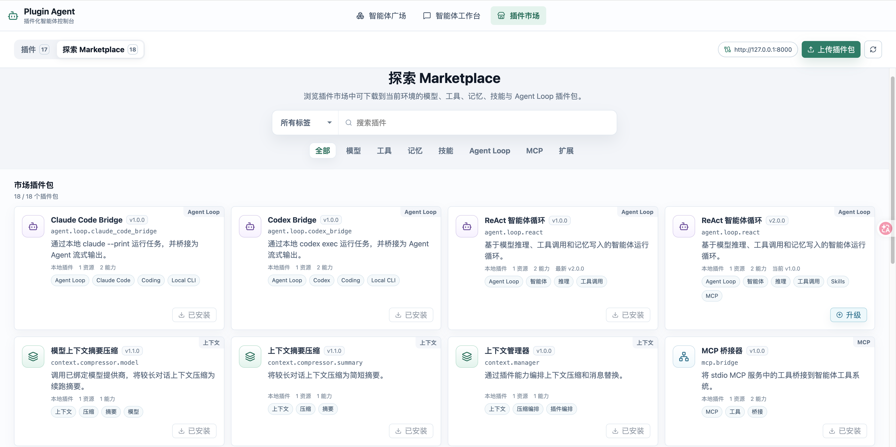

# Plugin Agent

<p align="center">
  <strong>一个由微内核和可插拔插件构成的 Agent 系统</strong>
</p>

<p align="center">
  
  
  
  
</p>

Plugin Agent 是一个由微内核和可插拔插件构成的 Agent 系统。内核只负责插件装配、能力路由、依赖诊断、会话运行和运行时边界，模型、工具、记忆、技能、MCP 桥接、上下文压缩和 Agent Loop 都以插件形式独立演进。

你可以像组装应用一样创建 Agent：选择需要的插件实例，配置密钥与运行参数，显式绑定能力 provider，并在控制台中运行带会话历史、工具调用和流式输出的智能体。

[<video src="docs/image/demo.mp4" controls width="100%"></video>](https://github.com/user-attachments/assets/344d4ac4-87da-4f42-99a3-792d87ab59c0)

## 核心能力

- 插件市场：通过控制台上传、安装、卸载和版本化管理插件包。
- Agent 装配：每个 Agent 都由独立插件实例组成，配置、密钥引用、生命周期和版本互不干扰。
- 能力路由：插件通过 `Capability` 调用彼此，内核负责 provider 选择、schema 校验、错误诊断和流式调用。
- 可视化控制台：React 控制台提供插件市场、Agent 广场、工作台、插件配置、会话列表和流式聊天。
- 运行时诊断：当模型配置缺失、依赖能力缺失或多个 provider 冲突时，后端会给出 Agent 运行时报告。
- 会话与记忆：会话历史由主机持久化，长期记忆由插件提供，Agent Loop 可以同时使用两者。
- 代码沙盒：`workspace.sandbox` 插件在隔离目录内提供 `ls/read/write/edit/grep/glob/bash` coding 工具，macOS 下命令执行可使用 Seatbelt 沙箱。
- Docker 部署：提供 backend + frontend 的 Docker Compose，一条命令即可启动完整控制台。

## 快速开始

### Docker 一键启动

```bash
cd docker
cp .env.example .env
docker compose up --build
```

打开控制台：

```text
http://127.0.0.1:8080
```

Docker 会从随镜像复制的 `plugin-market/` 自动安装默认插件包，并把运行时数据持久化到 `docker/volumes/plugin-agent-data`。

### 本地开发启动

后端：

```bash
cd backend
uv run plugin-agent serve --host 127.0.0.1 --port 8000
```

日志默认输出到 stdout，格式为 `时间 - logger - 级别 - 消息`。开发时可调整级别；如果未来打成本地 App，可以把日志写入用户数据目录方便排障：

```bash
uv run plugin-agent serve --log-level DEBUG --log-file ~/.plugin-agent/logs/backend.log
```

前端：

```bash
cd frontend
yarn install
yarn dev --host 127.0.0.1 --port 5173
```

打开：

```text
http://127.0.0.1:5173
```

## 项目结构

```text
plugin-agent/
  backend/          Python Agent 内核、产品服务/存储层、FastAPI HTTP API、SDK 和测试
  frontend/         React 控制台
  docker/           Docker Compose 部署配置
  docs/             用户文档
  example-plugin/   示例外部插件
  plugin-market/    本地插件市场包
  .agents/skills/   项目级 Codex Skills
```

后端内部按职责分层：`services/` 承载 Agent 装配、运行时和会话编排，`stores/` 承载 SQLite/secret 持久化，`models/` 放内部类型记录，`utils/` 放纯工具函数；`plugin_agent.assembly` 保留为兼容入口。

## 插件市场



当前本地插件市场位于 `plugin-market/`。查看每个插件的详细用途、能力、依赖和配置说明：[插件功能目录](./docs/plugins.md)。

| 插件 ID | 名称 | 类型 | 主要作用 |
| --- | --- | --- | --- |
| `agent.loop.react` | ReAct 智能体循环 | Agent Loop | 基于模型、工具、记忆、Skills 和 MCP 工具上下文运行智能体对话。 |
| `agent.loop.codex_bridge` | Codex Bridge | Agent Loop | 调用本地 `codex exec` 执行任务并桥接流式输出。 |
| `agent.loop.claude_code_bridge` | Claude Code Bridge | Agent Loop | 调用本地 `claude --print` 执行任务并桥接流式输出。 |
| `context.manager` | 上下文管理器 | 上下文 | 编排上下文压缩并生成后续模型消息。 |
| `context.compressor.summary` | 上下文摘要压缩 | 上下文 | 不依赖模型的轻量摘要压缩。 |
| `context.compressor.model` | 模型上下文摘要压缩 | 上下文 | 使用模型生成上下文续跑摘要。 |
| `memory.file` | 文件记忆 | 记忆 | 用 `MEMORY.md` 和 Markdown 文件保存智能体记忆。 |
| `skill.registry` | 技能注册表 | 技能 | 加载本地 `SKILL.md`，提供技能列表、激活和文件读取能力。 |
| `tool.runtime` | 工具运行时 | 工具运行时 | 发现工具、校验参数并路由工具调用。 |
| `tool.basic` | 基础工具集 | 工具 | 提供 echo、当前时间、数字相加等基础工具。 |
| `tool.http_request` | HTTP 请求工具 | 工具 | 调用固定 HTTP 端点或受限 Raw HTTP 请求。 |
| `workspace.sandbox` | 代码沙盒 | 工具 | 在隔离目录内读写文件、搜索和执行受限命令。 |
| `mcp.bridge` | MCP 桥接器 | MCP | 将 stdio MCP 服务工具桥接到 Agent 工具系统。 |
| `model.openai_compatible` | OpenAI 兼容模型 | 模型 | 接入 OpenAI Chat Completions 兼容服务。 |
| `model.openrouter` | OpenRouter 模型 | 模型 | 通过 OpenRouter 调用多家模型。 |
| `model.deepseek` | DeepSeek 模型 | 模型 | 通过 DeepSeek API 调用 DeepSeek 模型。 |

## 开发新插件

插件是扩展 Agent 能力的主要方式。新插件应基于公共 SDK `plugin_agent_sdk` 实现，并通过 capability 与其他插件组合协作；完整目录结构、契约声明、运行时代码和安装验证流程见：[插件开发指南](./docs/develop-plugins.md)。

## 参考文档

- [插件功能目录](./docs/plugins.md)
- [开发新插件](./docs/develop-plugins.md)
- [后端指南](./backend/README.md)
- [前端协作说明](./frontend/AGENTS.md)
- [Docker 部署说明](./docker/README.md)
- [项目协作规则](./AGENTS.md)
- [后端开发规则](./backend/AGENTS.md)
- [项目文档维护 Skill](./.agents/skills/maintain-project-docs/SKILL.md)

## 验证命令

```bash
cd backend && uv run pytest -q
cd frontend && yarn build
docker compose -f docker/docker-compose.yml config
```

## 后续演进

Plugin Agent 会继续保持“微内核 + 插件运行时”的边界。当前 `python.in_process` 适合开发期和可信插件，后续本地 App 形态会优先演进为桌面壳启动本地后端，同时保留浏览器访问同一个 `localhost` 控制台的能力。

本地运行时会拆成两层：Host Backend 负责 Agent 微内核、能力路由、会话、配置和诊断；Plugin Runtime Daemon 专门负责用户插件的安装、解包、依赖环境、进程启动、日志、热重载和调用转发。用户上传的插件默认不直接 import 到 Host Backend，而是由 daemon 放进独立工作目录并通过结构化协议调用。

插件运行时会从单一 Python in-process 逐步扩展为可替换的 runtime adapter：

- `python.venv_process`：为每个 Python 插件创建独立工作目录和 `.venv`，通过进程边界、超时和结构化协议调用插件，降低依赖冲突和崩溃影响。
- `http` / `wasm`：为远端服务插件和更强隔离的本地插件预留运行时。
- `Daemon Plugin`：使用隔离的daemon提供runtime依赖并运行插件。

本地 App 打包时会内置受控 Python runtime，用户无需自行安装 Python；用户上传的插件仍可声明依赖、资源需求和权限边界，由 Plugin Runtime Daemon 负责准备运行环境并执行。

## 许可证

本项目使用 [Apache License 2.0](./LICENSE)。
